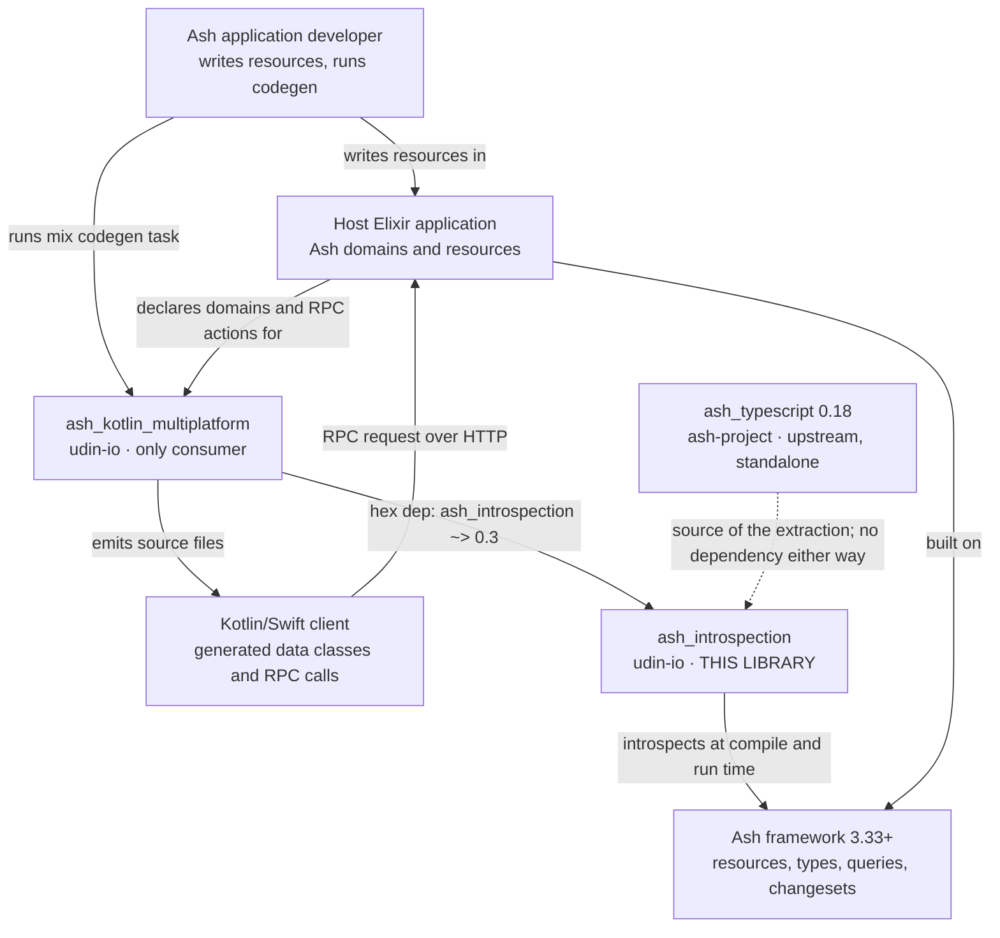
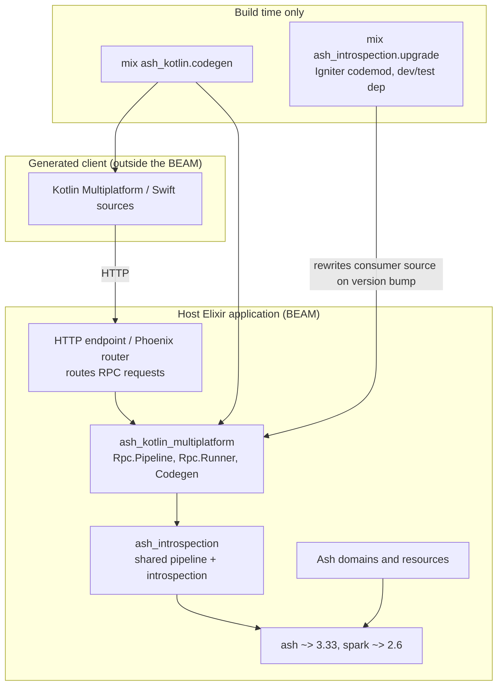
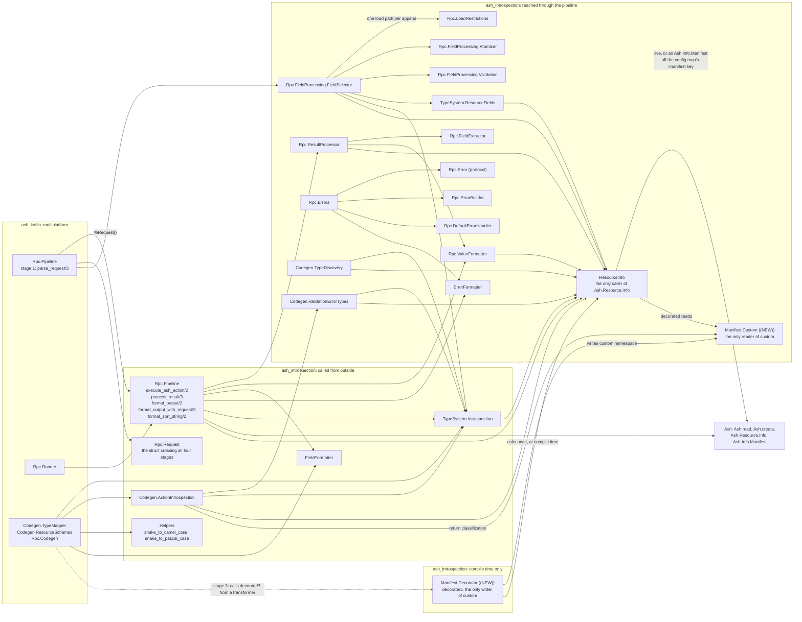
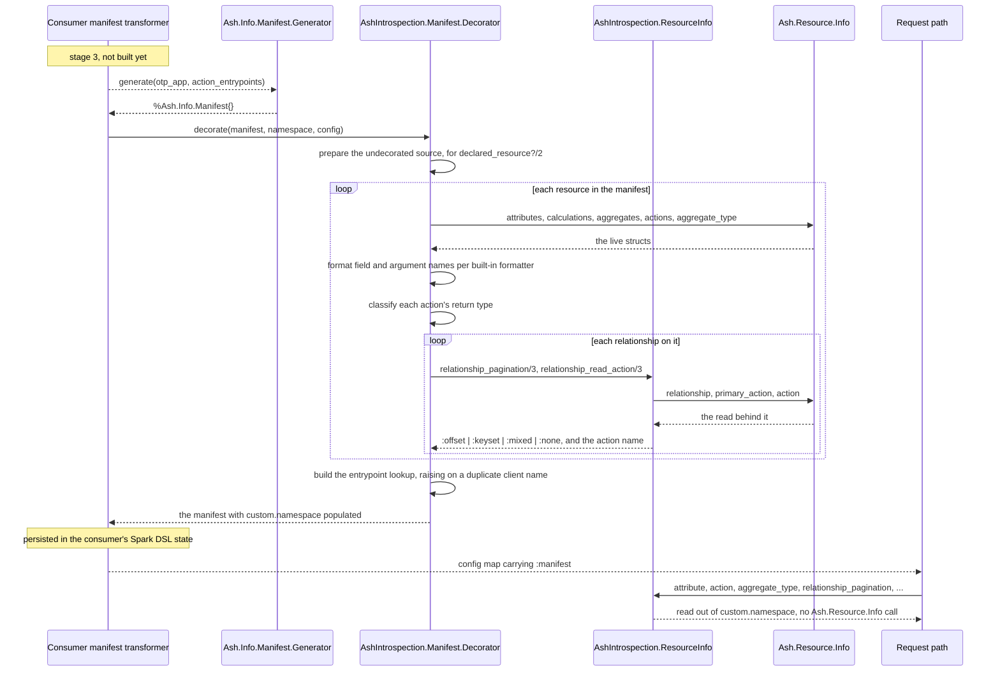
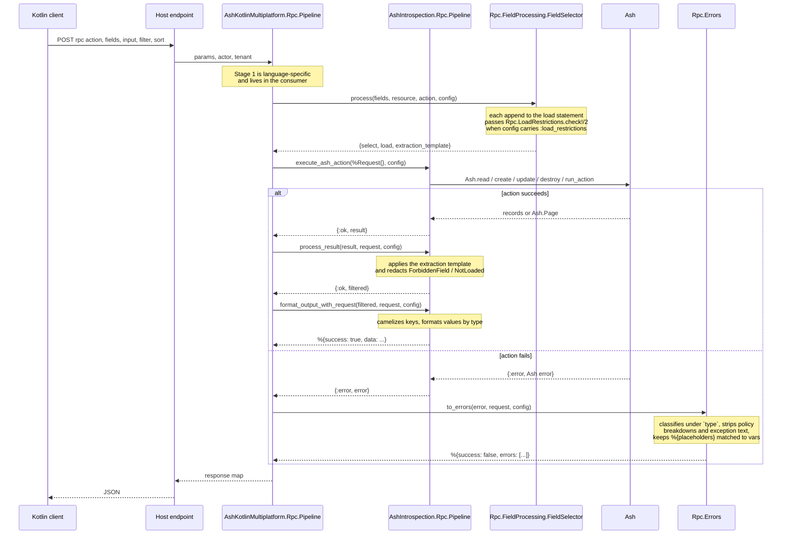

<!--
SPDX-FileCopyrightText: 2025 ash_introspection contributors

SPDX-License-Identifier: MIT
-->

# Architecture

C4 views of `ash_introspection` as it stands on `main`, 0.4.0 plus the
unreleased work through issue #23 stage 2, drawn from the code rather than from
the README. It exists because issue #36 found no written
account of the one relationship that confuses every new reader: `ash_typescript`
is upstream and standalone, this library is the core extracted from it, and
`ash_kotlin_multiplatform` is the only thing that depends on it. Use these
diagrams to decide where a change belongs before writing it.

## 1. Context

Who and what this library talks to. Solid arrows are compile-time or runtime
dependencies; the dashed arrow is provenance, not a dependency.

`ash_typescript` never calls this library and this library never calls it. The
shared code was copied out, so the two drift independently — see
[risks.md](risks.md).

## 2. Container

The publishable and runtime units. `ash_introspection` has no processes of its
own: it is compiled into the consumer, which is compiled into the host
application.

The `igniter` dependency is `only: [:dev, :test]`, and
`lib/mix/tasks/ash_introspection.upgrade.ex` guards itself with
`Code.ensure_loaded?(Igniter)`, so a production consumer never loads it.

## 3. Component — what the consumer actually calls

Only part of this library is consumer-facing. Everything else is reached
through `Rpc.Pipeline`. Stage 1 of the pipeline (parsing a client request) is
deliberately absent here: it is language-specific and lives in the consumer.

`ResourceInfo` is the seam issue #23 stage 1 added. Every `Ash.Resource.Info`
call in `lib/` goes through it — 64 of them, measured at `74afafd` — so a
later stage changes one module rather than nine. With no `:manifest` key on the
config map it reads live introspection, which is what every caller does today.
`grep -rn 'Ash\.Resource\.Info\.' lib` should match nothing outside
`lib/ash_introspection/resource_info.ex` and
`lib/ash_introspection/manifest/decorator.ex`.

`Manifest.Decorator` and `Manifest.Custom` are what #23 stage 2 added. The
dashed arrow is the edge that does not exist yet: nothing in this repo calls
`decorate/3` outside `test/support/manifest_fixture.ex`, and until stage 3
builds a manifest in the consumer, every production read is still live.

Measured 2026-09-09: `ash_kotlin_multiplatform` names `AshIntrospection` at 35
call sites across 21 files. `Helpers` is the most used (10), then
`TypeSystem.Introspection` (5), `FieldFormatter` (4), `Rpc.Request` (3),
`Rpc.Pipeline` (2) and `Codegen.ActionIntrospection` (2). That distribution is
why a change to `Helpers` or `TypeSystem.Introspection` is a breaking change in
practice even when the version number says otherwise.

## 4. The compile-time decoration pass

The second flow worth reading in order. It runs once, when the consumer's
manifest module compiles, and everything it writes is read by the request path
without touching `Ash.Resource.Info` again. The consumer half is stage 3 of
issue #23 and does not exist yet, which is why the first two messages are
dashed.

A module the decorator cannot load is **skipped**, not guessed at:
`Code.ensure_loaded?/1` guards every read, per the repo-wide rule from #49, and
the resource stays in the manifest bare. A bare resource reads live, so the
answer is right and nothing says the decoration was missed. That silence is the
staleness trap #23 records: the caller owns the compile edges — forcing every
referenced module to compile first, and giving the manifest module a
compile-time dependency on the domains it was built from — and that is stage
3's job, not this library's.

## 5. The four-stage RPC pipeline

The one flow worth reading in order, because each stage constrains the next and
only three of the four live here.

Two properties of the error branch are load-bearing and easy to undo: the class
of the error is reported under `type` and never `code` (0.3.0), and a
message's `%{placeholder}` names must keep matching the keys in `vars` after
Stage 4 has camelized everything around them. Both have regression tests —
`test/ash_introspection/rpc/error_type_key_test.exs` and
`test/ash_introspection/rpc/pipeline_error_placeholder_test.exs`.

## 6. What is not here

- **No manifest module, and no manifest in production yet.** Stage 1 of issue
  #23 added `AshIntrospection.ResourceInfo` and an optional `:manifest` config
  key; stage 2 added the decorator that fills it and the reader that empties
  it. Nothing builds a manifest: the manifest module needs a Spark DSL to
  declare entrypoints, and #23 puts that DSL in `ash_kotlin_multiplatform`, not
  here. So every read in production is still live, and stage 2's decoration is
  exercised only by `test/support/manifest_fixture.ex`. Stages 3 to 5 are on
  the roadmap — see [roadmap.md](roadmap.md) and
  [decisions.md](decisions.md).
- **No persistence.** `test/support/*.ex` uses `Ash.DataLayer.Ets`; there is no
  repo, no migration directory and no database setup step.
- **No contract test with the consumer.** Nothing in either repo fails when the
  shared surface changes shape. See [risks.md](risks.md).
